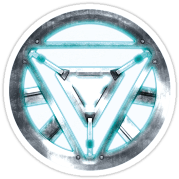

<a name="readme-top">

<br/>

<br />
<div align="center">
  <a href="https://github.com/zyx-0314/">
  <!-- TODO: If you want to add logo or banner you can add it here -->
    
  </a>
<!-- TODO: Change Title to the name of the title of your Project -->
  <h3 align="center">Seatwork3</h3>
</div>
<!-- TODO: Make a short description -->
<div align="center">
  Aaron V. Beltran
</div>

<br />

<!-- TODO: Change the zyx-0314 into your github username  -->
<!-- TODO: Change the WD-Template-Project into the same name of your folder -->


---

<br />
<br />

<!-- TODO: If you want to add more layers for your readme -->
<details>
  <summary>Table of Contents</summary>
  <ol>
    <li>
      <a href="#overview">Overview</a>
      <ol>
        <li>
          <a href="#key-components">Key Components</a>
        </li>
        <li>
          <a href="#technology">Technology</a>
        </li>
      </ol>
    </li>
    <li>
      <a href="#rules-and-principles">Rules and Principles</a>
    </li>
    <li>
      <a href="#resources">Resources</a>
    </li>
  </ol>
</details>

---

## Overview

<!-- TODO: To be changed -->
The project's goal is to use HTML and CSS to construct an aesthetically pleasing header and footer display website with both static and animated header and footer versions. The website highlights the significance of both creativity and utility in web design by showcasing five distinct styles for each component.

Guiding Question:
- What is the project - The project is to create a landing page, different designs of headers, and footers.
- Whats the purpose - The purpose of this activity is for us to be able to improve our skills on how we create and design different types of headers and footer in a website.
- What are key components - MultiPage Website.
- What technology used and how it is used - Using HTML and CSS with the help of Visual Studio Code I am able to achieve the said project.

### Key Components
<!-- TODO: List of Key Components -->
<!-- The following are just sample -->
- MultiPage Website
- Animations

### Technology
<!-- TODO: List of Technology Used -->


## Rules and Principles
1. Always use ***WD-*** in the front of the Title of the Project for the Subject followed by your custom naming.
2. Do not rename any .html files; always use 'index.html' as the filename.
3. File Structure to follow

```
WD-ProjectName
└─ assets
|   └─ css
|   |   └─ style.css
|   └─ img
|   |   └─ fileWith.jpeg/.jpg/.webp/.png
|   └─ js
|       └─ script.js
└─ pages
|  └─ pageName
|     └─ assets
|     |  └─ css
|     |  |  └─ style.css
|     |  └─ img
|     |  |  └─ fileWith.jpeg/.jpg/.webp/.png
|     |  └─ js
|     |     └─ script.js
|     └─ index.html
└─ index.html
└─ readme.md
```

## Resources

<!-- TODO: Add References -->
| Title | Purpose | Link |
|-|-|-|
| W3Schools | Most of the animation parts Like pulse I learned form here. | https://www.w3schools.com/ |
|Youtube| My guide on creating designs. | https://www.youtube.com/watch?v=nkZz9DOBzBI |
